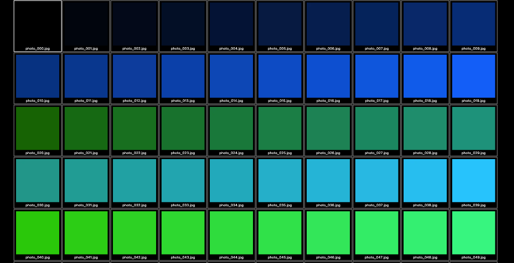
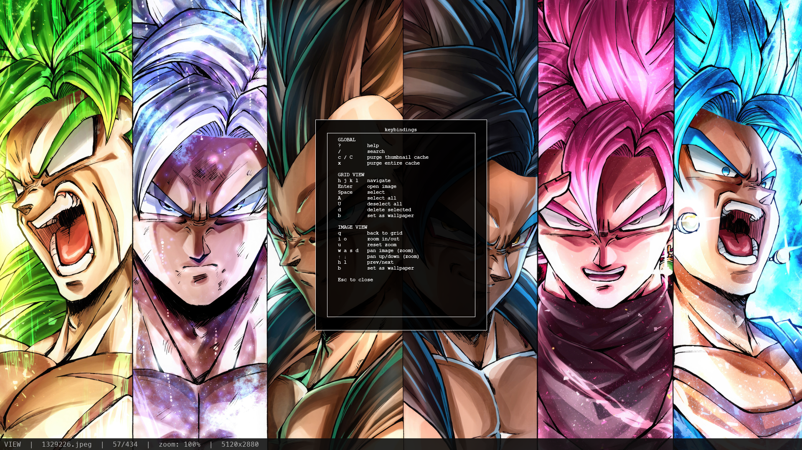

# pix — Minimal Vim-style Image Viewer

`pix` is a fast, keyboard-driven, minimalistic image viewer inspired by `mpv`. It features a zero-chrome interface (no titlebar, no toolbars, no scrollbars), vim-style keybindings, rapid thumbnail loading, and fuzzy search capabilities. All UI elements like search, help, and confirmations appear as floating overlays on the canvas.

## Screenshots

### Grid View


### Fuzzy Search


### Image View


---

## Features
- **Zero Chrome UI**: Borderless and frameless window.
- **Vim-style Keybindings**: Keyboard-first navigation.
- **Fast Thumbnail Loading**: Extracts embedded EXIF thumbnails for near-instant loading and uses a persistent disk cache for subsequent loads.
- **Fuzzy Search**: Quickly search for images by filename using an overlay search bar.
- **Universal Overlays**: Help sheets, search, and confirmation dialogues all float directly on the image canvas.

---

## Dependencies

The project relies on a few key Python packages:
- `pillow` — Image decoding and resizing
- `thefuzz` & `python-Levenshtein` — Fast fuzzy searching capabilities
- `pyinstaller` — (For building) Packaging the application into a single standalone executable

You can install the dependencies using `pip`:
```bash
pip install -r requirements.txt
```

---

## How to Build / Generate Binary

**OS Prerequisites:** 
PyInstaller requires the standard Python `tkinter` GUI bindings to successfully bundle the graphical application.

- **macOS:** You must install the `python-tk` package via Homebrew:
  ```bash
  brew install python-tk
  ```
- **Linux (Ubuntu/Debian):** You need the `python3-tk` package installed:
  ```bash
  sudo apt install python3-tk
  ```
- **Windows:** `tkinter` dependencies are shipped by default with the official Python installer. Just ensure the "tcl/tk and IDLE" option was checked during your installation.

To generate a single, standalone binary executable (no Python installation required for end users), you can use the provided build script.

1. Ensure dependencies are installed (including `pyinstaller`).
2. Run the `build.sh` script:

```bash
chmod +x build.sh
./build.sh
```

**Alternatively, you can run the build command manually:**
```bash
pyinstaller --onefile --windowed --name pix main.py
```

The resulting binary will be located at `dist/pix`.

---

## How to Use

### Launch Modes

Run `pix` from the terminal by passing an image or directory:

```bash
# Flat load a directory (shows thumbnail grid)
./pix ./photos

# Recursive load (all subdirectories)
./pix -r ./photos

# Single image mode (opens directly to full image view, without grid)
./pix ./photo.jpg
```

### Keybindings

**Global / Overlays**
- `?` : Show keybinding help overlay (dismiss with `Esc` or `?`)
- `/` : Open fuzzy search bar (type to search, `Enter` to open, `Esc` to close)
- `C` : Purge cache for the currently loaded folder

---

**Grid View (Thumbnail Mode)**
- `h` `j` `k` `l` : Navigate grid (left, down, up, right)
- `Enter` : Open selected image in full view
- `Space` : Toggle select image
- `V` : Select all images
- `d` : Delete selected images (opens confirmation overlay)
- `Ctrl+d` / `Ctrl+u` : Scroll grid down / up
- `g g` : Jump to the first image
- `G` : Jump to the last image
- `[N] g` : Jump to the N-th image (e.g., `5 g` jumps to the 5th image)
- `q` : Quit application

---

**Image View (Full Image Mode)**
- `q` : Go back to the thumbnail grid
- `h` / `l` : Previous / Next image
- `+` / `-` : Zoom in / out (10% steps)
- `0` : Reset zoom (fit to window)
- `W` / `H` : Fit to width / height
- `Mouse scroll` : Zoom in/out at the cursor position
- `Mouse drag` : Pan when zoomed in
- `w` `a` `s` `d` : Pan (up, left, down, right) when zoomed in
- `v` : Enter region-select mode
  - `Enter` (while in region mode): Zoom into the selected region
  - `Esc`: Cancel region select
- `d` : Delete current image (opens confirmation overlay)

### Cache Management

`pix` generates thumbnails and stores them aggressively to ensure instantaneous loading. You can manage the cache using CLI flags as well:

```bash
# Purge entire cache, then exit
./pix --clear-cache

# Purge cache strictly for a specific folder, then exit
./pix --clear-cache ./photos

# Purge cache for a recursive scan of the current directory, then exit
./pix -r --clear-cache .
```
