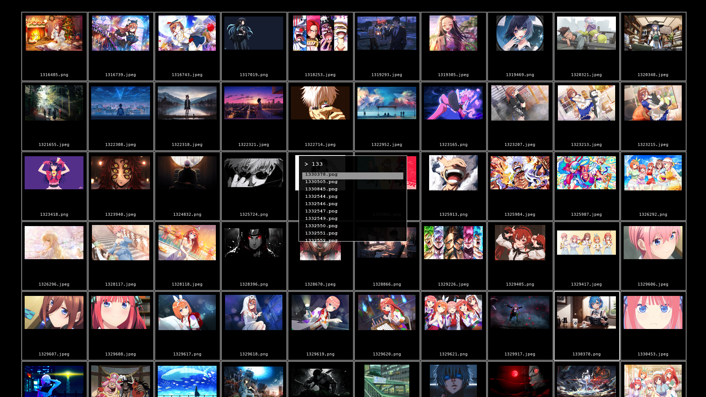

# pix — Minimal Vim-style Image Viewer

`pix` is a fast, keyboard-driven, minimalistic image viewer inspired by `mpv`. It features a zero-chrome interface (no titlebar, no toolbars, no scrollbars), vim-style keybindings, rapid thumbnail loading, and fuzzy search capabilities. All UI elements like search, help, and confirmations appear as floating overlays on the canvas.

## Screenshots

Click any card to open the full-size screenshot.

<table>
  <tr>
    <td width="33%" align="center" valign="top">
      <a href="assets/showcase-grid-view-v2.png">
        
      </a>
      <br />
      <strong>Grid View</strong>
      <br />
      Dense browsing with fast keyboard focus and wallpaper-first presentation.
    </td>
    <td width="33%" align="center" valign="top">
      <a href="assets/showcase-fuzzy-search-v2.png">
        
      </a>
      <br />
      <strong>Fuzzy Search</strong>
      <br />
      Search floats over the canvas so you stay inside the gallery while jumping fast.
    </td>
    <td width="33%" align="center" valign="top">
      <a href="assets/showcase-image-view-v2.png">
        
      </a>
      <br />
      <strong>Image View</strong>
      <br />
      Full-screen viewing keeps the artwork front and center with overlays on demand.
    </td>
  </tr>
</table>

---

## Features
- **Zero Chrome UI**: Borderless and frameless window.
- **Vim-style Keybindings**: Keyboard-first navigation.
- **Fast Thumbnail Loading**: Extracts embedded EXIF thumbnails for near-instant loading and uses a persistent disk cache for subsequent loads.
- **Fuzzy Search**: Quickly search for images by filename using an overlay search bar.
- **Universal Overlays**: Help sheets, search, and confirmation dialogues all float directly on the image canvas.

---

## Dependencies

The project relies on a few key Python packages:
- `pillow` — Image decoding and resizing
- `thefuzz` & `python-Levenshtein` — Fast fuzzy searching capabilities
- `pyinstaller` — (For building) Packaging the application into a single standalone executable

You can install the dependencies using `pip`:
```bash
pip install -r requirements.txt
```

---

## How to Build / Generate Binary

**OS Prerequisites:**
This repository now targets macOS only. PyInstaller requires the standard Python `tkinter` GUI bindings to successfully bundle the graphical application.

- **macOS:** Install the `python-tk` package via Homebrew:
  ```bash
  brew install python-tk
  ```

To generate the macOS app bundle and a fast command-line launcher, you can use the provided build script.

1. Ensure dependencies are installed (including `pyinstaller`).
2. Run the `build.sh` script:

```bash
chmod +x build.sh
./build.sh
```

**If you want to run the PyInstaller steps manually:**
```bash
pyinstaller -y pix.spec
pyinstaller -y pix_cli.spec
```

Use `./build.sh` if you also want it to generate the `dist/pix` launcher wrapper for you.

Build outputs:
- `dist/pix.app` — GUI app bundle for Finder / DMG distribution
- `dist/pix` — fast terminal launcher that can be copied into a directory like `/usr/local/bin`
- `dist/pix_cli/` — fast CLI runtime used by the launcher

### Install `pix` Into Your PATH

The `dist/pix` launcher can run from anywhere after you install it into a directory on your `PATH`.

```bash
chmod +x install_pix.sh
./install_pix.sh
```

On Apple Silicon Macs, that script prefers `/opt/homebrew/bin`. If `/usr/local/bin` is writable on your machine, you can target it explicitly:

```bash
./install_pix.sh /usr/local/bin
```

For the launcher to stay fast, keep either `dist/pix_cli/` or `pix.app` available. The launcher checks, in order:
- `pix_cli/` next to the launcher
- `~/Library/Application Support/pix/pix_cli/` (used by `install_pix.sh`)
- `pix.app` next to the launcher
- `/Applications/pix.app`
- `~/Applications/pix.app`

### How to Build a macOS `.dmg`

If you want a drag-and-drop macOS installer image, use the bundled DMG helper after `dist/pix.app` has been built:

```bash
chmod +x build_dmg.sh
./build_dmg.sh
```

That script packages `dist/pix.app` into `dist/pix.dmg` and includes an `Applications` shortcut inside the disk image so users can drag `pix.app` into their Applications folder.

If `dist/pix.app` does not exist yet, `build_dmg.sh` will run `./build.sh` for you first.

---

## How to Use

### Launch Modes

Run `pix` from the terminal by passing an image or directory. If you have not installed it into your `PATH` yet, use `dist/pix` in the examples below instead.

```bash
# Flat load a directory (shows thumbnail grid)
pix ./photos

# Recursive load (all subdirectories)
pix -r ./photos

# Single image mode (opens directly to full image view, without grid)
pix ./photo.jpg

# Set a single image as wallpaper and exit
pix --set-wallpaper ./photo.jpg
```

### Keybindings

**Global / Overlays**
- `?` : Show keybinding help overlay (dismiss with `Esc` or `?`)
- `/` : Open fuzzy search bar (type to search, `Enter` to open, `Esc` to close)
- `c` / `C` : Purge cache for the currently loaded folder
- `x` : Purge the entire thumbnail cache directory

---

**Grid View (Thumbnail Mode)**
- `h` `j` `k` `l` : Navigate grid (left, down, up, right)
- `Enter` : Open selected image in full view
- `Space` : Toggle select image
- `A` : Select all images
- `U` : Deselect all images
- `V` : Select all images
- `b` : Set the selected image as the desktop wallpaper
- `d` : Delete selected images (opens confirmation overlay)
- `Ctrl+d` / `Ctrl+u` : Scroll grid down / up
- `g g` : Jump to the first image
- `G` : Jump to the last image
- `[N] g` : Jump to the N-th image (e.g., `5 g` jumps to the 5th image)
- `q` : Quit application

---

**Image View (Full Image Mode)**
- `q` / `Esc` : Go back to the thumbnail grid, or quit if `pix` was launched with a single image
- `h` / `l` : Previous / Next image
- `b` : Set the current image as the desktop wallpaper
- `i` / `o` : Zoom in / out (10% steps)
- `u` : Reset zoom (fit to window)
- `w` `a` `s` `d` : Pan (up, left, down, right) when zoomed in
- `Up` / `Down` : Pan up / down when zoomed in

### Cache Management

`pix` generates thumbnails and stores them aggressively to ensure instantaneous loading. You can manage the cache using CLI flags as well:

```bash
# Purge cache strictly for a specific folder, then exit
pix --clear-cache ./photos

# Purge cache for a recursive scan of the current directory, then exit
pix -r --clear-cache .

# Set wallpaper directly from the binary, then exit
pix --set-wallpaper ./photo.jpg
```

Inside the app, `x` clears the entire `~/.cache/pix` directory.
